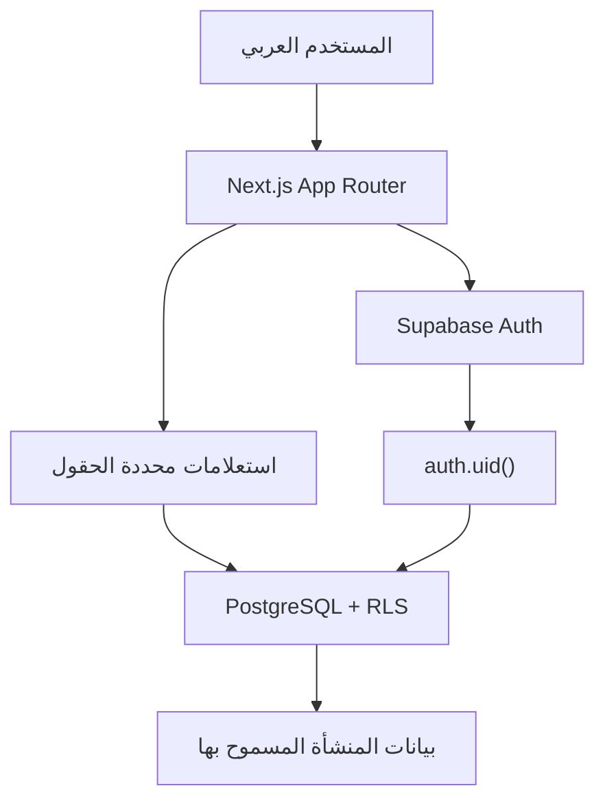

# المعمارية التقنية

## المبادئ

- PostgreSQL هو مصدر الحقيقة للبيانات والصلاحيات.
- Supabase Auth يثبت هوية المستخدم؛ العضوية والدور يأتيان من `organization_members`.
- Next.js App Router يقدم الصفحات وServer Actions أو Route Handlers مستقبلًا.
- RLS اختصار **Row Level Security — أمان مستوى الصفوف** وهو الحاجز النهائي بين المنشآت.
- كل مؤشر ناتج عن دالة حتمية قابلة للاختبار، وليس عن منطق مخفي داخل الواجهة.

## تدفق الطلب

## الطبقات المخططة

| الطبقة | المسؤولية |
| --- | --- |
| `app/` | المسارات، التخطيطات، حالات التحميل والخطأ، وواجهات RTL |
| `lib/supabase/` | عملاء المتصفح والخادم، كوكيز الجلسة، وتجديد مصادقة Supabase |
| `lib/data/` | استعلامات محددة الحقول تستبعد `deleted_at` وتجمع لوحة المحفظة والعقار |
| `lib/domain/` | منطق تواريخ الرياض وتنسيق القيم وإنشاء جدول الدفعات القابل للاختبار |
| `lib/scoring/` | محرك المؤشرات وإعداداته وإصدار الصيغة وحفظ Snapshots |
| `supabase/migrations/` | الجداول والقيود والدوال والسياسات والمشغلات |
| `tests/` | اختبارات الحساب وRLS وتطبيق Migrations |

## حدود الثقة

1. المتصفح غير موثوق، ولا يحمل مفتاح `service_role`.
2. جلسة Supabase تعطي `auth.uid()` فقط، ولا تعطي منشأة موثوقة من طلب العميل.
3. قاعدة البيانات تتحقق من العضوية والدور لكل عملية.
4. `organization_id` في الطلب لا يمنح صلاحية؛ يستخدم فقط كهدف تتحقق منه السياسة.
5. العمليات الآلية التي تحتاج صلاحيات أعلى تنفذ على الخادم فقط وبأضيق نطاق ممكن.

## تعدد المنشآت

- `organizations` هو جذر المستأجر المنطقي.
- جميع الجداول التابعة تحمل `organization_id uuid not null`.
- العلاقات التابعة تستخدم مفاتيح خارجية مركبة تشمل `organization_id` لمنع ربط سجل بعقار أو عقد من منشأة أخرى.
- `is_org_member()` للقراءة، و`has_org_role()` للكتابة بحسب الدور.
- إنشاء المنشأة يتم عبر `create_organization()` في معاملة واحدة تضيف المنشأة والمالك الأساسي.

## الزمن والمال

- تخزن اللحظات باستخدام `timestamptz`؛ العرض وحدود الفترات التجارية تستخدم `Asia/Riyadh`.
- تواريخ الاستحقاق والعقود من نوع `date` لأنها تواريخ أعمال وليست لحظات زمنية.
- جميع المبالغ من نوع `numeric(15,2)`، ويمنع `float` و`real` و`double precision` للأموال.

## المصادقة ومسار المنشأة

- إنشاء الحساب والدخول يتمان عبر Supabase Auth من إجراءات خادمية.
- المسارات المحمية تتحقق من الجلسة في Proxy ثم تعيد التحقق داخل التخطيط الخادمي.
- المستخدم بلا عضوية يُحوّل إلى إعداد المنشأة، وتستدعي العملية `create_organization()` لإنشاء المنشأة والمالك في معاملة واحدة.
- المنشأة النشطة محفوظة في Cookie آمنة، لكنها لا تمنح صلاحية؛ تتم مطابقتها دائمًا مع عضويات المستخدم المرئية عبر RLS.
- مصفوفة القدرات في `lib/auth/permissions.ts` تضبط الواجهة والحراس، بينما تبقى سياسات قاعدة البيانات هي الحاجز النهائي.

## تدفقات المرحلة الخامسة

- تقرأ لوحة المحفظة العقارات والوحدات والعقود والاستحقاقات والتحصيل والمصروفات ولقطات المؤشرات باستعلامات محددة الحقول، ثم تجمعها داخل الخادم للمنشأة النشطة فقط.
- تحسب حدود الشهر وتاريخ اليوم وفق `Asia/Riyadh` حتى لا تتغير النتائج باختلاف موقع الخادم.
- إنشاء الوحدة يضيف فترة الحالة الافتتاحية في المعاملة نفسها عبر `create_unit_with_history()`.
- تعديل حالة الوحدة يغلق الفترة السابقة ويفتح فترة جديدة دون تداخل عبر `update_unit_with_history()`.
- إنشاء العقد وجدول الدفعات عملية ذرية عبر `create_lease_with_schedule()`؛ فإما أن يحفظ العقد والجدول معًا أو لا يحفظ أي منهما.
- إنهاء العقد يوقف الاستحقاقات المستقبلية المعلقة ويعيد الوحدة إلى الشاغر عبر `terminate_lease()`.

## تدفقات المرحلة السادسة

- تجمع صفحات الدفعات والمصروفات ومقارنة السوق وسجل المؤشرات بيانات المنشأة النشطة على الخادم باستعلامات محددة الحقول، وتتوفر المساحات نفسها داخل تبويبات العقار.
- تسجيل دفعة على استحقاق يتم ذريًا عبر `record_schedule_payment()` بعد قفل الاستحقاق وحساب المتبقي؛ ويمنع المشغل تجاوز مبلغ الاستحقاق حتى عند تزامن طلبين.
- أي إضافة أو تعديل أو إلغاء منطقي لدفعة يعيد حالة الاستحقاق تلقائيًا إلى `pending` أو `partially_paid` أو `paid` أو `overdue` وفق تاريخ الرياض.
- إلغاء الدفعة يتم عبر `void_payment()` للمالك أو المدير ويحتفظ بالسجل المالي والتدقيق بدل حذفه ماديًا.
- المصروفات المدفوعة فقط تدخل صافي التدفق، بينما يبقى غير المدفوع ظاهرًا كالتزام مستقل.
- مقارنة السوق تختار أحدث مرجع مطابق داخل نوع المصدر نفسه، ولا تجمع عقدًا منفذًا مع عرض معلن أو تقدير يدوي.
- لقطة المؤشر اليومية تحفظ مدخلاتها ونتائجها وإصدار المعادلة، ويمنع قيد فريد إنشاء أكثر من لقطة للعقار في التاريخ نفسه.

## تشديد المرحلة السابعة

- فعّلت خيارات TypeScript الصارمة للحالات الاختيارية، والوصول إلى الفهارس، ومسارات الإرجاع، والسقوط بين حالات `switch`.
- توحّدت قواعد التحقق الخادمية للتواريخ الفعلية ومعرفات UUID والبريد، مع قيود قاعدة بيانات مكافئة للتواريخ المالية والسوقية الحساسة.
- قُيّدت وجهات إعادة التوجيه الداخلية، وثُبّت أصل تأكيد التسجيل من إعداد موثوق.
- أضيفت ترويسات أمان ومنع تخزين الصفحات المحمية، مع تحسين التركيز بلوحة المفاتيح وأهداف اللمس والتباين والتنقل السفلي على الجوال.
- تغطي اختبارات المرحلة السابعة التحويلات المشفرة، والتواريخ غير الحقيقية، وتهيئة جميع دوال `security definer` بمسار بحث فارغ.

## القرارات المؤجلة

- لا يوجد مزود Ejar أو scraping في هذه المرحلة.
- لا يوجد مخزن مستندات أو تكامل خارجي.
