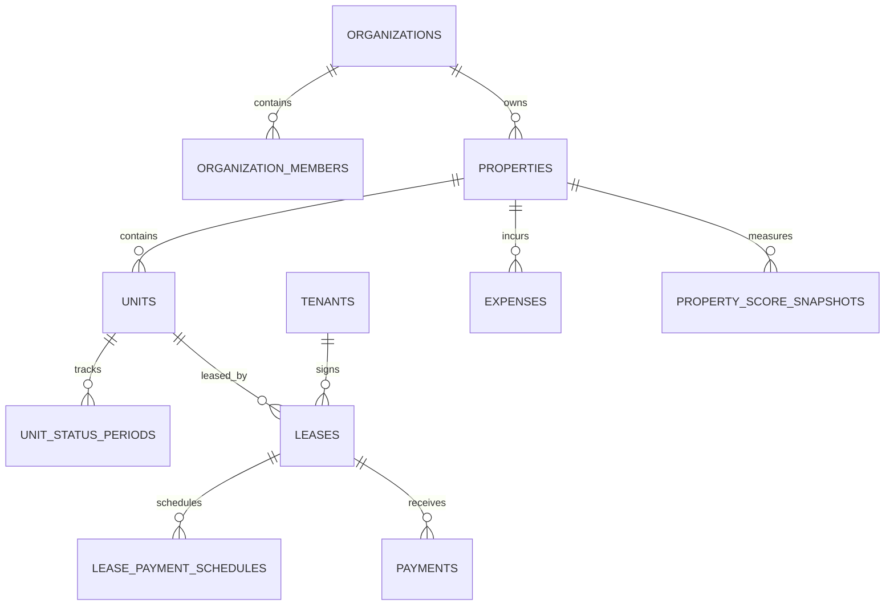

# نموذج البيانات

## القاعدة العامة

يتكون النموذج من 14 جدولًا رئيسيًا. `organizations` هو الجذر؛ أما الجداول الحساسة التابعة فتحتوي على `organization_id uuid not null`. جميع العلاقات التابعة تعيد التحقق من المنشأة داخل المفتاح الخارجي المركب.

## الجداول

| الجدول | الغرض | ملاحظات أساسية |
| --- | --- | --- |
| `organizations` | المنشآت المستقلة | `created_by` هو المالك الأساسي غير القابل للتغيير المباشر |
| `organization_members` | العضوية والدور | دور واحد من owner أو manager أو accountant أو viewer |
| `properties` | العقارات والعمائر | حذف منطقي، و`total_units` يزامن آليًا من الوحدات النشطة منطقيًا |
| `units` | وحدات العقار | حالة الوحدة مقيدة، ورقمها فريد داخل العقار النشط |
| `unit_status_periods` | تاريخ حالة الوحدة | فترات غير متداخلة لحساب أيام الإشغال بدقة |
| `tenants` | بيانات المستأجر الضرورية | لا تحفظ صورة هوية؛ `national_id_reference` مرجع خارجي/مموّه فقط |
| `leases` | العقود | عقد نشط واحد فقط لكل وحدة، مع حذف منطقي |
| `lease_payment_schedules` | الاستحقاقات | المبلغ المستحق وحالته لكل تاريخ |
| `payments` | التحصيل الفعلي | يرتبط بالاستحقاق عند التحصيل، ويمنع تجاوز المتبقي، وكل تغيير مهم مدقق |
| `expense_categories` | تصنيفات المصروف | الاسم فريد داخل المنشأة |
| `expenses` | المصروفات | ربط الوحدة اختياري، وربط العقار إلزامي |
| `market_benchmarks` | مراجع السوق | كل سجل يحتفظ بنوع المصدر والفترة والعينات منفصلة |
| `property_score_snapshots` | تاريخ المؤشرات | لقطة واحدة لكل عقار وتاريخ، تحتفظ بـJSONB للمدخلات والمخرجات وإصدار الصيغة |
| `audit_logs` | أثر التغييرات الحساسة | لا يقبل إدخالًا مباشرًا من مستخدم التطبيق |

JSONB يعني **JSON Binary — تمثيل JSON ثنائي داخل PostgreSQL** يتيح حفظ لقطة منظمة وقابلة للاستعلام.

## العلاقات

## القيود المهمة

- الإحداثيات أرقام عشرية دقيقة مع حدود latitude وlongitude.
- المساحات والمبالغ والنسب غير سالبة حيث يلزم.
- `start_date <= end_date` للعقود وفترات السوق.
- `area_min_sqm <= area_max_sqm`، و`lower_rent_range <= annual_market_rent <= upper_rent_range` عندما تتوفر الحدود.
- `organization_id` غير قابل للتعديل المباشر بعد الإنشاء.
- `created_by` في السجلات المالية غير قابل للتعديل.
- المالك الأساسي المحدد بـ`organizations.created_by` لا يمكن حذف عضويته أو خفض دوره مباشرة.
- مجموع الدفعات النشطة المرتبطة باستحقاق لا يمكن أن يتجاوز مبلغه، ولا تقبل الاستحقاقات الملغاة دفعات جديدة.
- تاريخ Snapshot فريد داخل العقار والمنشأة.
- لا يقبل `payments.payment_date` تاريخًا مستقبليًا، ولا يقبل المصروف المستقبلي بحالة مدفوع، ولا تقبل فترة سوق تنتهي مستقبلًا؛ تحتسب الحدود بتوقيت الرياض.
- لا يمكن إدخال دفعة أو مصروف بقيمة `deleted_at` معدة مسبقًا للتحايل على السجلات النشطة.

## الحذف

- الجداول التشغيلية الأساسية تستخدم `deleted_at` للحذف المنطقي.
- الاستعلامات العادية يجب أن تضيف `deleted_at is null`.
- الدفعات والمصروفات لا تحذف ماديًا من واجهة قاعدة البيانات؛ الإلغاء أو الحذف منطقي للمالك والمدير وتبقى التغييرات في سجل التدقيق.
- `property_score_snapshots` سجلات تاريخية؛ لا تعدل بعد إنشائها.

## المال

الأعمدة المالية كلها `numeric(15,2)`، ومنها الإيجارات، التأمين، الاستحقاقات، الدفعات، المصروفات، تدفقات Snapshot، وفجوة الإيجار بالريال. هذا يمنع أخطاء التقريب الناتجة عن أنواع الأرقام العائمة.
